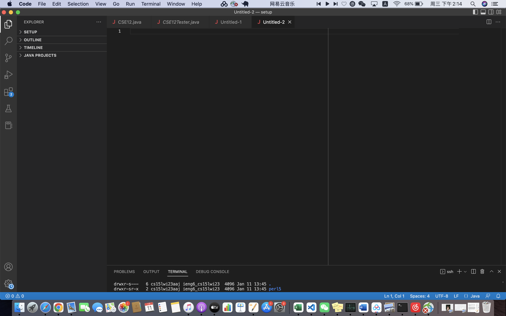
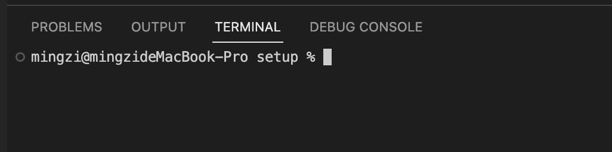
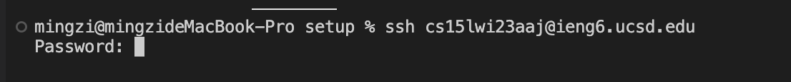
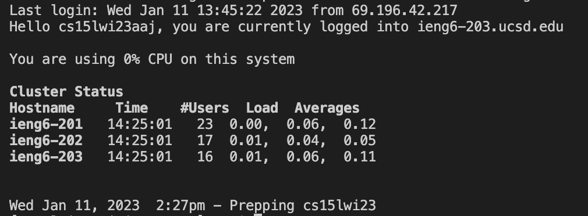

# CSE 15l Lab1 Report

## how to log into a course-specific account on ieng6
1. open VScode

2. open a terminal in VScode

3. write 'ssh username@ieng6.ucsd.edu', and enter

4. enter the password

